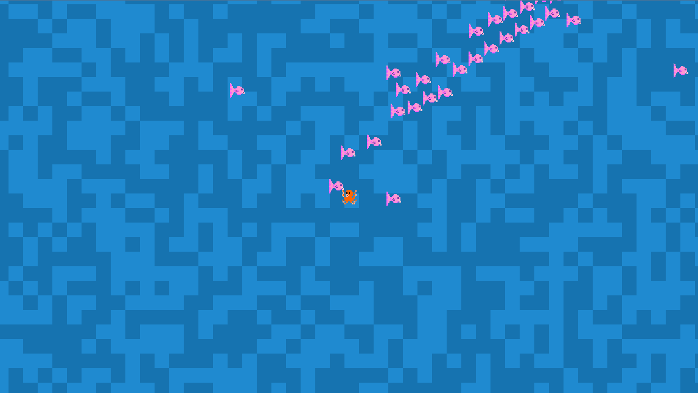

# RC Survivors



A small game built at the [The Recurse Center](https://recurse.com) using [Godot](https://godotengine.org/) by [Nadia Heredia](https://github.com/nadia-nh), [Scott Sheffield](https://github.com/scottsheffield), [Sasha Mishkin](https://github.com/sasha-of-the-pixels), and [Joseph Abrahamson](https://github.com/tel).

You play as an octopus swimming in the water, moving around to avoid incoming fish.  
There is no combat or health system, the fish continuously follow the player, and if enough fish catch up to them, they won’t be able to move anymore.

Be careful and avoid the incoming fish for as long as you can!

## Running the game

Clone the repo:
```bash
git clone https://github.com/nadia-nh/rc-survivors-game.git
cd rc-survivors-game.git
```

Run with Godot 4:

Import the project, and run the main scene with the run project button or by pressing `F5`.

Controls:

- Arrow keys / WASD — move

## Resources

- [Godot Documentation – Creating a 2D Game](https://docs.godotengine.org/en/latest/getting_started/first_2d_game/index.html)  
  Used as a reference for learning core 2D game concepts in Godot.

## Assets

- **Player and enemy images**  
  Created by Sasha for this project.

- **Background water images**
  Creator: [You're perfect studio](https://opengameart.org/users/youre-perfect-studio)  
  Source: [Water tiles](https://opengameart.org/content/water-tiles)  
  License: CC by 4.0

---

Made with <3 at [The Recurse Center](https://recurse.com).  
